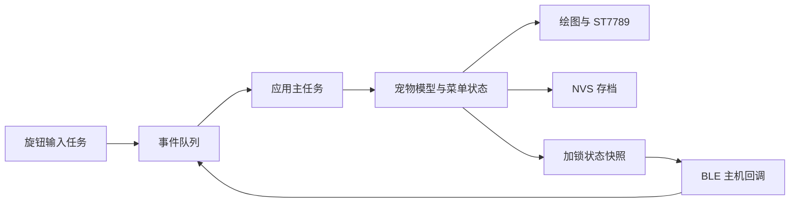

# 阅读代码前需要理解的 ESP32 概念

你已经会 C/C++，这里不再解释循环、指针和结构体，而是解释同一段 C++ 放到 ESP32 上后，哪些执行条件发生了变化。

## 芯片、模块与开发板

ESP32 是芯片系列名称；ESP-WROOM-32 是包含芯片、Flash、射频等部分的模块；开发板再把模块、电源、USB 转串口和排针组合起来。模块丝印不能告诉你板载 LED 在哪一脚，因此课程保留单独的板级配置。

本项目使用经典 ESP32 目标，对应 Xtensa 架构。你已有 RISC-V 基础对理解寄存器、中断和内存有帮助，但先使用 ESP-IDF API，不必从汇编或裸写寄存器开始。

## GPIO 是什么

GPIO 是可配置的数字引脚。设为输出时可以输出高/低电平；设为输入时读外部电平。GPIO32 指芯片信号编号，不是排针上的第 32 个位置。

`gpio_config_t` 描述哪些脚、什么模式、是否上拉和是否中断。`1ULL << pin` 把某个 GPIO 对应的一位置 1；多个脚用按位或合并。先初始化模式，再读写电平。

上拉为输入提供默认高电平。按钮按下接地，于是读到 0 表示按下。输入悬空时可能乱跳，因此不能只把按钮接一根信号线。GPIO 输出电平用于信号控制，不是电机、风扇或普通扬声器的电源。

## 一个机械动作为什么会产生多个电平变化

按钮接触点会抖动。课程先记录“最新原始电平何时开始保持”，持续 25 ms 后才接受为稳定状态。稳定状态是电平，SELECT/BACK 是一次性事件，两者要分开。

长按记录稳定按下的时刻，达到 700 ms 发一次 BACK，并设置已发标记；释放时看到标记就不再发 SELECT。只检查“当前是否低电平”会在每轮循环重复触发。

编码器 A/B 两路相位不同，典型顺序为 00→01→11→10→00，反过来是反转。程序累计合法转移，不是简单地“看到 A 变化就加一”。实际模块每卡点可能对应不同数量的转移，需要第 3 课实测校准。

## ESP-IDF 程序从哪里开始

复位后芯片启动代码加载引导程序，引导程序加载应用，ESP-IDF 初始化运行环境和 FreeRTOS，然后在主任务中调用 `app_main`。

原生 ESP-IDF 自带 FreeRTOS。你可以只在主任务中写一个循环，也可以创建任务。创建任务并不意味着每个任务拥有独立 CPU；调度器会在可运行任务之间分配执行时间。

本项目 C++ 文件中写 `extern "C" void app_main(void)`，让链接器找到 ESP-IDF 约定的入口名称。普通模块函数不需要全部加 extern C。

## 为什么不在无限循环里一直计算

如果高优先级任务一直忙循环，低优先级任务可能没有机会执行，甚至触发看门狗。`vTaskDelay` 表示当前任务暂时等待，让出 CPU；它不会让所有任务一起停止。

循环中的两个长延时仍然会使同一任务里的两个功能互相拖延。第 1 课用两个时间戳，分别判断灯和日志是否到期，再短暂让出 CPU。

`esp_timer_get_time` 返回开机后的微秒。课程 `nowMs` 转成 32 位毫秒；比较经过时间用无符号减法，而不是假设时间戳永远不会回绕。RTOS tick 是另一种时间单位，使用 `pdMS_TO_TICKS` 转换。

## 任务、队列、回调和中断

任务可以等待。回调只是“由某个库在事件发生时调用你的函数”，不一定在中断里；本课程 BLE 回调在蓝牙主机任务中，DMA 完成回调在中断上下文中。

中断处理要短，不能使用普通阻塞等待。DMA 完成回调使用 `xSemaphoreGiveFromISR`，通过返回值告知驱动是否需要切换任务。不要把普通队列接口直接放入中断。

队列让生产者交出一份事件副本。这里事件是小枚举；不传局部数组或临时字符串的指针，所以接收时数据仍然有效。队列满时拒绝新事件并计数，绝不在蓝牙回调里无限等待。

只有应用任务修改宠物和界面；蓝牙只读取快照。这样你新增雷达时，只需把雷达事件送进队列，不必让雷达任务直接操作屏幕。

## 屏幕里的像素在哪里

ST7789 控制器有用于显示的存储空间。ESP32 先把要更新的矩形像素准备在 RAM 中，通过 SPI 写入屏幕对应区域。背光亮不代表控制器已经收到了正确像素。

RGB565 用 16 位描述一个像素：红 5 位、绿 6 位、蓝 5 位。它和发送字节顺序是两回事，RGB/BGR 顺序又是另一回事。色条课分别验证这些条件。

本课程不在 RAM 里存整屏，而是用一块 16 行缓冲分块绘制。每次绘图都裁剪到当前块，所以可以用同一个场景函数重画整屏或局部。

## DMA 为什么容易造成花屏

DMA 允许硬件在后台从 RAM 读取像素并发送。提交函数返回，并不代表后台已经读完。如果立刻覆盖同一块内存，屏幕可能显示前半帧和后半帧混合的数据。

课程显式等待 DMA 完成信号，再复用缓冲。它牺牲了一部分 CPU/总线重叠机会，但所有权很清楚。双缓冲进阶才让 A 发送时绘制 B；必须知道哪块仍由 DMA 使用。

局部刷新解决“哪些像素需要重新传输”；双缓冲解决“绘图与传输怎样重叠”；TE/扫描同步解决另一类撕裂问题。这些机制相关，但不能相互替代。

## 蓝牙为什么不是串口

BLE GATT 服务由特征组成，特征有 UUID 和读写权限。手机发现服务后写命令特征，或读状态特征；订阅 Notify 后，设备才能主动推送状态。

Write with response 的成功只代表本课的合法命令已经入队。应用之后可能因宠物睡眠而拒绝玩耍，所以需要再观察状态中的 R。需要逐条可靠结果时，要设计命令序号和执行应答。

## 存档为什么不能每一帧都写

NVS 把小型键值数据保存在 Flash。动画每帧变化不需要保存；真正需要保留的是模型状态。集中按周期或明确动作保存，既更容易理解一致性，也避免无意义写入。

不要把 C++ 结构体原样当文件格式，因为它可能有填充字节，后续字段或编译选项也会变化。课程显式写出每个字节，检查版本与范围，验证成功后才替换当前模型。

## 学会读错误信息

`esp_err_t` 是 ESP-IDF 返回的错误码，不等于布尔值。ESP_OK 表示成功，其他值应通过 `esp_err_to_name` 查看含义。初始化阶段的 `ESP_ERROR_CHECK` 失败会打印来源并终止启动；运行阶段的存档失败会显示提示并限制重试。

`assert`/`configASSERT` 用于发现程序内部假设被破坏，不是所有外部错误的处理方式。不要把创建任务等有副作用的操作写在断言表达式里，否则关闭断言可能连操作也消失。

每次排错先找第一条有意义的错误。编译成功只说明源代码能产生固件，烧录成功只说明固件已写入，硬件验收才说明接线、时序和实际交互正确。
